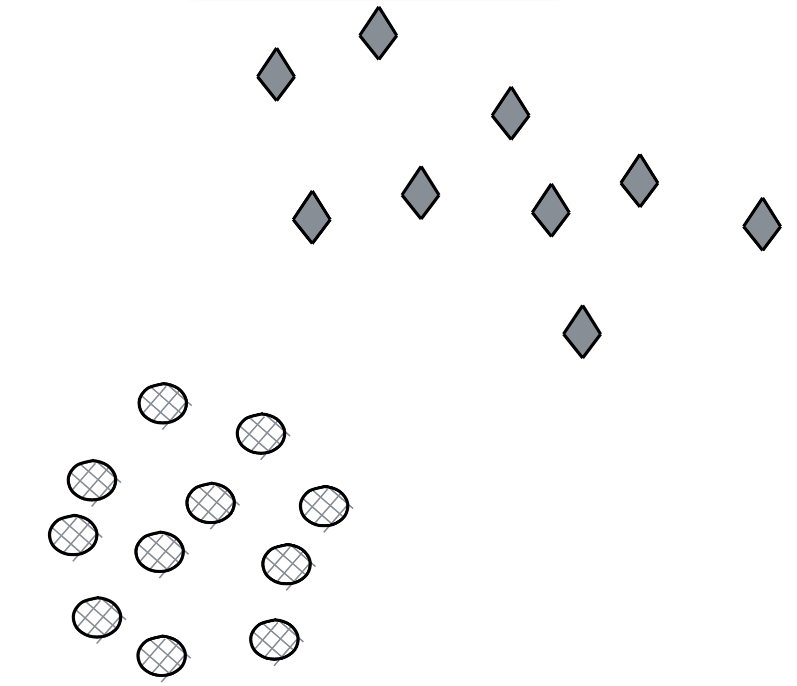
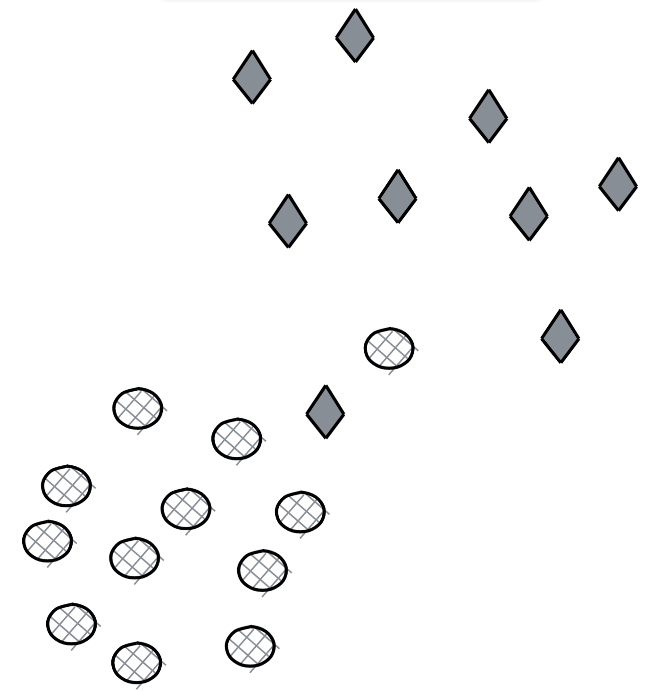

# Data Science Interview Questions And Answers

Topics
---

- [Support Vector Machines](#support-vector-machines)

## Contents

## Support Vector Machines

1. SVM.
    1. What’s linear separation? Why is it desirable when we use SVM?
    
    1. How well would vanilla SVM work on this dataset?
    
    1. How well would vanilla SVM work on this dataset?
    
    1. How well would vanilla SVM work on this dataset?
    

<b>Answer</b>

---

2. What is the main difference between Support Vector Machines (SVM) and Support Vector Regression (SVR)?

<b>Answer</b>

---

3. What are the key components of SVR?

<b>Answer</b>

---

4. What is the role of the ε-tube in SVR?

<b>Answer</b>

---

5. What are the different types of SVR Kernels, and when should they be used?

<b>Answer</b>

---

6. How do you tune the hyperparameters in SVR?

<b>Answer</b>

---

7. What is the significance of the regularization parameter (C) in SVR?

<b>Answer</b>

---

8. How does SVR handle outliers in the data?

<b>Answer</b>

---

9. What are the evaluation metrics used to assess the performance of SVR models?

<b>Answer</b>

---

10. What are the advantages and disadvantages of SVR compared to other regression techniques?

<b>Answer</b>

---

11. Can SVR be used for time series forecasting?

<b>Answer</b>

---

